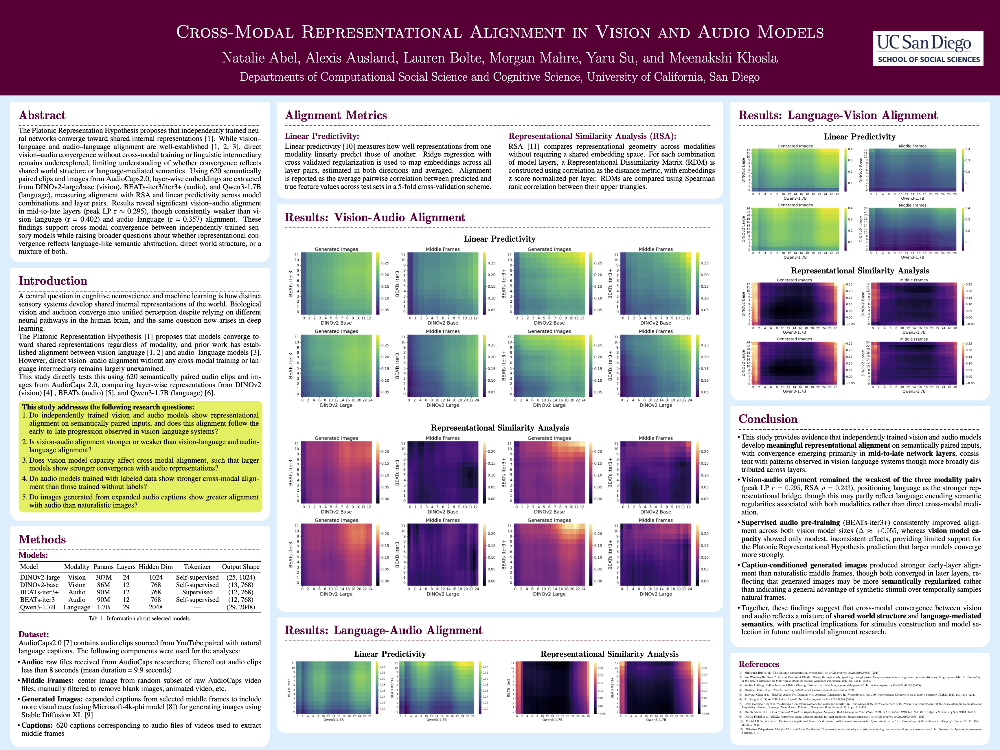

# Cross-Modal Representational Alignment in Vision and Audio Models
Capstone Members: Natalie Abel, Alexis Ausland, Lauren Bolte, Morgan Mahre, Yaru Su\
Faculty Advisor: Meenakshi Khosla

CSS M.S. Capstone exploring representational alignment between vision-only and audio-only models, with comparisons to a language model.

## Repository Contents
- [capstone_paper.pdf](capstone_paper.pdf) - Final research paper describing the background, research questions, methodology, results and discussion.
- [capstone_presentation_poster.png](capstone_presentation_poster.png) - Academic poster summarizing the project.
- [frames_audio.ipynb](frames_audio.ipynb) - Extracts middle frames from Audiocaps2.0 video files and prepares audio files.
- [image_generation.ipynb](image_generation.ipynb) - Expands captions and generates images.
- [embeddings.ipynb](embeddings.ipynb) - Extracts layer embeddings from DINOv2, BEATs, and Qwen models.
- [all_alignment_results.ipynb](all_alignment_results.ipynb) - Computes Linear Predictivity and Representational Similarity Analysis (RSA) for all model pairs, and generates heatmaps to interpret model alignment.

## Technologies
- Python
- NumPy
- Pandas
- PyTorch
- Hugging Face Transformers
- Stable Diffusion
- SciPy
- scikit-learn
- Seaborn

## Poster Preview
**[View the full academic poster here](capstone_presentation_poster.png)**

